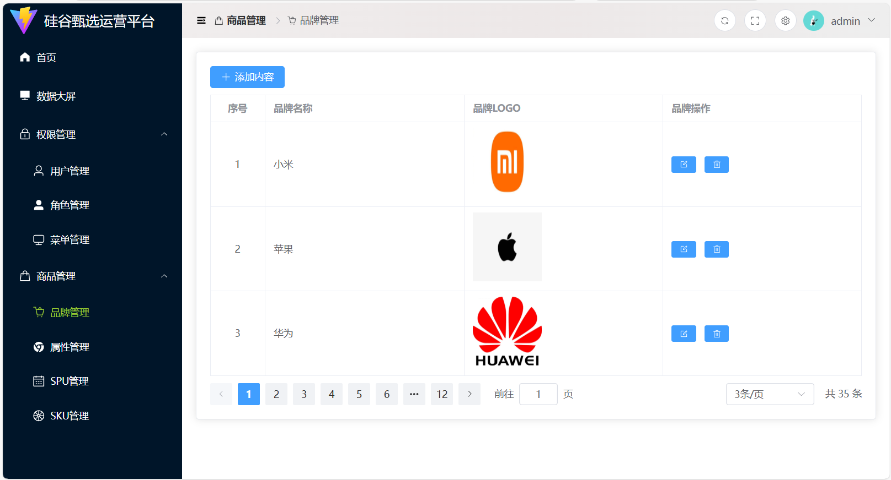
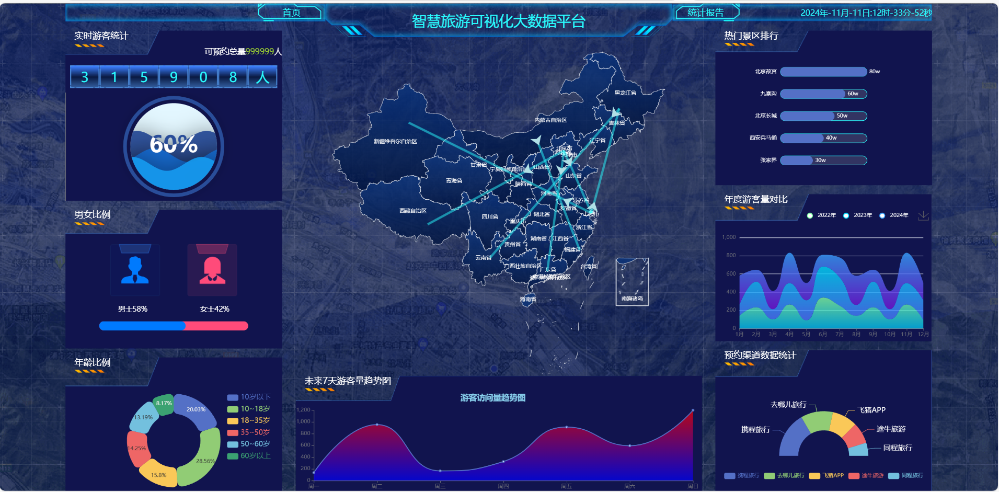

# Vue 3 + TypeScript + Vite

**使用技术**：Vue 3组合式API + TypeScript + Vite构建工具+vue-router路由+Pinia状态管理+element-plus组件库+Axios网络交互

**<——接口文档——>**

服务器域名:http://sph-api.atguigu.cn
swagger文档:
http://139.198.104.58:8209/swagger-ui.html
http://139.198.104.58:8212/swagger-ui.html#/

echarts:国内镜像网站
https://www.isqqw.com/echarts-doc/zh/option.html#title
http://datav.aliyun.com/portal/school/atlas/area_selector

LoginPage

HomePage

Data Screen Page

